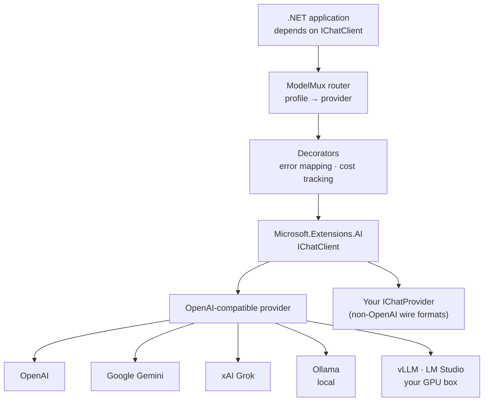

# ModelMux

**Switch AI providers from configuration, not code.**

[](https://github.com/tkakashofficial-dev/ModelMux/actions/workflows/ci.yml)

ModelMux maps logical model profiles — `fast`, `smart`, `private` — onto OpenAI, Google Gemini,
xAI Grok, Ollama, or any OpenAI-compatible endpoint. Your application depends on `IChatClient`
and never on a vendor.

```csharp
// Your code. It never names a provider, and never changes.
public class ReportService(IChatClient ai)
{
    public Task<ChatResponse> SummariseAsync(string data) =>
        ai.GetResponseAsync([new ChatMessage(ChatRole.User, $"Summarise: {data}")]);
}
```

```jsonc
// Your configuration. This is the only thing you change.
{
  "ModelMux": {
    "DefaultProfile": "fast",
    "Profiles": {
      "fast":    { "Provider": "Gemini", "Model": "gemini-2.5-flash", "ApiKeyEnvironmentVariable": "GEMINI_API_KEY" },
      "smart":   { "Provider": "OpenAI", "Model": "gpt-5-mini",       "ApiKeyEnvironmentVariable": "OPENAI_API_KEY" },
      "private": { "Provider": "Ollama", "Model": "llama3" }
    }
  }
}
```

```csharp
builder.Services.AddModelMux(builder.Configuration);   // that's the whole setup
```

---

## Why ModelMux?

Provider lock-in in .NET is subtle. `Microsoft.Extensions.AI` already solved the *interface*
problem — `IChatClient` is a genuinely good abstraction and ModelMux does **not** replace it.
What's missing is everything around choosing an implementation:

| | Microsoft.Extensions.AI | ModelMux |
|---|:---:|:---:|
| Common `IChatClient` abstraction | ✅ | uses it |
| Streaming, tools, middleware | ✅ | uses it |
| Pick a provider from `appsettings.json` | ❌ | ✅ |
| Several providers side by side in one app | ❌ | ✅ |
| Logical profiles instead of vendor names | ❌ | ✅ |
| Repoint at a self-hosted GPU with no code change | ❌ | ✅ |
| Vendor-neutral error categories | ❌ | ✅ |
| Per-model capability checks | ❌ | ✅ |

Without it, wiring a provider means hand-writing the same factory in every project. ModelMux is
that factory, written once, driven by config.

## Architecture



Only the configuration decides which leaf serves a request. The application sees `IChatClient`
throughout.

## Installation

```bash
dotnet add package ModelMux
dotnet add package ModelMux.Cost   # optional: token and cost tracking
```

> Not yet on NuGet — clone and reference the projects for now.

## Quick start

```csharp
var builder = WebApplication.CreateBuilder(args);

builder.Services.AddModelMux(builder.Configuration);

var app = builder.Build();

app.MapPost("/api/chat", async (ChatRequest req, IChatClient ai) =>
{
    var response = await ai.GetResponseAsync([new ChatMessage(ChatRole.User, req.Message)]);
    return Results.Ok(new { reply = response.Text });
});

app.Run();
```

## Provider configuration

**OpenAI**

```jsonc
"smart": { "Provider": "OpenAI", "Model": "gpt-5-mini", "ApiKeyEnvironmentVariable": "OPENAI_API_KEY" }
```

**Google Gemini** — reached through its OpenAI-compatible endpoint

```jsonc
"fast": { "Provider": "Gemini", "Model": "gemini-2.5-flash", "ApiKeyEnvironmentVariable": "GEMINI_API_KEY" }
```

**xAI Grok**

```jsonc
"grok": { "Provider": "Grok", "Model": "grok-4.6", "ApiKeyEnvironmentVariable": "XAI_API_KEY" }
```

**Ollama** — local, no API key

```jsonc
"private": { "Provider": "Ollama", "Model": "llama3" }
```

```bash
ollama serve
ollama pull llama3
```

**Anything else that speaks the OpenAI protocol** — vLLM, LM Studio, LocalAI, a rented GPU:

```jsonc
"gpu": {
  "Provider": "OpenAI",
  "Model": "llama-3-70b",
  "Endpoint": "http://your-gpu-box:8000/v1/"
}
```

Providers with a genuinely different wire format get their own `IChatProvider`:

```csharp
builder.Services.AddModelMux(builder.Configuration)
    .AddProvider(new MyAnthropicProvider());
```

## Switching providers

This is the part that matters. Take this service:

```csharp
public class ReportService(IChatClient ai)
{
    public Task<ChatResponse> SummariseAsync(string data) =>
        ai.GetResponseAsync([new ChatMessage(ChatRole.User, $"Summarise: {data}")]);
}
```

Move from Gemini to OpenAI to a self-hosted GPU:

```jsonc
"fast": { "Provider": "Gemini", "Model": "gemini-2.5-flash" }              // today
"fast": { "Provider": "OpenAI", "Model": "gpt-5-mini" }                    // next month
"fast": { "Provider": "OpenAI", "Model": "llama-3-70b",
          "Endpoint": "http://gpu-box:8000/v1/" }                          // next year
```

**What this does and doesn't mean.** Switching is a configuration change plus an application
restart — not a runtime hot-swap. Profiles are resolved when the router is constructed, and
clients are cached for its lifetime. The saving is that you skip the edit-build-review-deploy
cycle, not that the process reconfigures itself while running.

`ReportService` is untouched in all three cases. There is a test that enforces exactly this —
[`ProviderSwitchingTests`](tests/ModelMux.Core.Tests/ProviderSwitchingTests.cs) runs identical
application code against three providers.

## Model profiles

A profile names a model by the *role* it plays, not by who sells it:

| Profile | Meaning | Might be |
|---|---|---|
| `fast` | cheap, everyday | Gemini Flash |
| `smart` | worth paying for | GPT-5 |
| `private` | must not leave the building | local Ollama |

Most code injects `IChatClient` and never learns profiles exist. When a component genuinely
needs to choose:

```csharp
public class ReportService(IModelMux mux)
{
    public Task<ChatResponse> DraftAsync(string d) => mux.GetClient("fast").GetResponseAsync(...);
    public Task<ChatResponse> AuditAsync(string d) => mux.GetClient("smart").GetResponseAsync(...);
}
```

## Capabilities

Providers are not interchangeable in practice. Check before you ask, and fail before the
round-trip:

```csharp
mux.RequireCapability("StructuredOutput", "private");   // throws UnsupportedCapabilityException
```

```jsonc
"private": {
  "Provider": "Ollama", "Model": "llama3",
  "Capabilities": { "ToolCalling": false, "StructuredOutput": false, "ContextWindow": 8192 }
}
```

## Structured output

```csharp
record Analysis(string Category, double Confidence, string Summary);

var result = await mux.GetStructuredResponseAsync<Analysis>(
    "Analyse this support ticket: ...", profileName: "smart");
```

The capability check runs first, so a model that can't do this fails with a clear message
rather than returning unparseable prose.

## Error handling

Provider failures arrive classified, so you never catch a vendor's exception type:

```csharp
try
{
    await ai.GetResponseAsync(messages);
}
catch (ModelMuxProviderException ex) when (ex.IsRetryable)
{
    // RateLimit, Timeout, ProviderUnavailable
}
catch (ModelMuxProviderException ex)
{
    // AuthenticationFailure, InvalidRequest, ContentFiltered
    logger.LogError(ex, "Provider {Provider} failed: {Category}", ex.Provider, ex.Category);
}
```

The original exception is always preserved as `InnerException` — classification adds
information, it never hides any.

## Cost tracking (optional)

`ModelMux.Cost` records what every call cost, attributed per tenant and per feature.

```csharp
builder.Services
    .AddModelMux(builder.Configuration)
    .AddCostTracking();                  // one extra line
```

```csharp
using (UsageScope.Begin(tenantId: "acme-corp", feature: "invoice-extraction"))
{
    await ai.GetResponseAsync(messages);
}

var summary = await usage.SummarizeAsync(new UsageFilter { TenantId = "acme-corp" });
```

Without a scope, usage is attributed to the profile name, so per-profile cost works with zero
caller effort. Prices ship for 57 Anthropic, OpenAI and Gemini models, each with a
`LastVerified` date and a source URL. An unpriced model records `null` — never `0` — and
surfaces as `UsageSummary.UnpricedCount`, so a total is never quietly understated.

## Demos

**Console** — shows the routing table, no API key needed:

```bash
dotnet run --project samples/ModelMux.Sample
```

**Web API** — `POST /api/chat`, streaming, and a natural-language reporting endpoint:

```bash
dotnet run --project samples/ModelMux.WebDemo
curl localhost:5000/
```

| Endpoint | What it does |
|---|---|
| `GET /` | current profile → provider mapping |
| `POST /api/chat` | provider-neutral chat |
| `POST /api/chat/stream` | the same, as server-sent events |
| `POST /api/reports/query` | natural language → validated report |
| `GET /api/usage` | token and cost totals |

### The reporting demo, and why it's shaped that way

`POST /api/reports/query` answers questions like *"active employees who joined this year and
took more than 10 leave days"* over synthetic data. The pipeline is deliberately four steps:

```
natural language → model proposes a structured intent
                 → application validates it against an allowlist
                 → application executes it
                 → intent returned to the caller, so the decision is inspectable
```

**The model never writes SQL and never chooses what executes.** It emits a `ReportIntent`
constrained to a fixed vocabulary of reports, fields, and operators. Anything else — a
hallucinated field, an unknown operator, a value that won't parse — is rejected before
execution. A model that can emit arbitrary SQL is a SQL-injection vector with a
natural-language front end; this design removes that category of risk rather than mitigating it.

The validator is covered by [19 adversarial tests](tests/ModelMux.WebDemo.Tests/IntentValidatorTests.cs).

## Docker

```bash
docker build -f samples/ModelMux.WebDemo/Dockerfile -t modelmux-demo .
docker run -p 8080:8080 -e GEMINI_API_KEY=... modelmux-demo
```

Fully local, no API key, no data leaving the machine:

```bash
docker compose up --build
docker compose exec ollama ollama pull llama3
```

Docker is never required for local development, and no model weights are in this repository.

## API keys

Use `ApiKeyEnvironmentVariable` so credentials stay out of config files and out of git:

```jsonc
{ "Provider": "OpenAI", "Model": "gpt-5-mini", "ApiKeyEnvironmentVariable": "OPENAI_API_KEY" }
```

A literal `ApiKey` field exists for local spikes. It lands in `appsettings.json`, so the
environment variable wins when both are set. See [SECURITY.md](SECURITY.md).

## Status

**v0.1 — experimental.** It works and is tested, but the API may change before 1.0.

```bash
dotnet test    # 152 passing; 5 live-provider tests skip unless API keys are set
```

| Package | Purpose |
|---|---|
| `ModelMux` | profiles, routing, providers, capabilities, error mapping |
| `ModelMux.Cost` | token, cost and latency tracking |

## Positioning

ModelMux explores a provider-neutral AI runtime for .NET applications, built **on top of**
Microsoft's AI abstractions, focused on model portability, deployment flexibility, and
production concerns. It is an experiment; adoption and technical merit will decide whether it
becomes more than that.

## Roadmap

- [x] **v0.1** — profiles, config-driven switching, OpenAI/Gemini/Grok/Ollama, self-hosted endpoints
- [x] **v0.1** — capabilities, vendor-neutral error categories, structured output
- [x] **v0.1** — cost and token tracking per tenant, feature and profile
- [ ] **v0.2** — fallback and resilience: retry, timeout, circuit breaker
- [ ] **v0.3** — OpenTelemetry tracing and metrics
- [ ] **v0.4** — semantic caching
- [ ] **v0.5** — persistent usage store (PostgreSQL)
- [ ] **v1.0** — stable API, benchmarks, production hardening

Deliberately out of scope: RAG, agents, vector stores, GPU orchestration. Reasoning in
[`docs/architecture-decisions.md`](docs/architecture-decisions.md).

## Documentation

| Document | What's in it |
|---|---|
| [How it works](docs/how-it-works.md) | A guided walkthrough of every concept in the codebase — DI, decorators, `AsyncLocal`, tokens, streaming, and the safe NL→query design |
| [Architecture decisions](docs/architecture-decisions.md) | Why the code is shaped this way, and what is deliberately not built |
| [Contributing](CONTRIBUTING.md) | How to build, test, and propose changes |
| [Security](SECURITY.md) | Credential handling and what ModelMux does not protect you from |

## Contributing

See [CONTRIBUTING.md](CONTRIBUTING.md). No API keys needed — every unit test uses a fake
provider and touches no network.

## License

MIT
